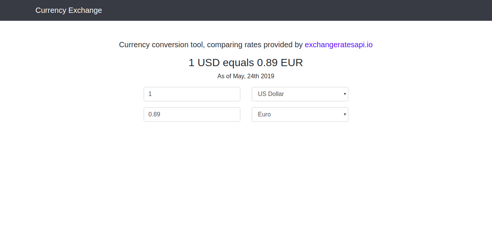

# Currency Exchange

This project was created as a change to develop a simple currency exchange application that resembles [Google's search driven conversion](https://www.google.com/search?q=1+USD+to+EUR&oq=1+USD+to+EUR), using currency rate information provided by [exchangeratesapi.io](https://exchangeratesapi.io).

## Dependencies

This application was developed with the following:
 - [Bootstrap 4](https://getbootstrap.com)
 - [Vue.js](https://vuejs.org)
 - [Moment.js](https://momentjs.com/)

